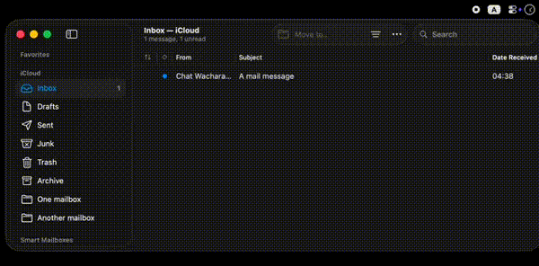

# Keyboard-only navigation to a folder in the Apple Mail app
Author: Chat Wacharamanotham (chat.wacharamanotham@gmail.com)




## Installation

1. Specify the "Hotkey" entries on the left of the workflow
2. Go to the Mail app and press any of the hotkeys. The first time will take some time to populate the list of mailboxes. (Apple Script slowed down dramatically in macOS Tahoe.)

## Usage

Change the current mailbox:
1. With the Apple Mail app in focus, press a shortcut key to show Alfred with a special search field
2. Type parts of the name of the folder to jump to and press Enter
3. The frontmost window of the Mail app will show that folder.

Move the selected message to a mailbox:
1. Select message(s) in Apple Mail
2. Press a shortcut key to show Alfred with a special search field
3. Type parts of the name of the folder to jump to and press Enter
4. The message will be moved to those mailboxes

Re-loading mailbox list:
- You can press the specified hotkey to force a reload.
- Additionally, each time the workflow is triggered, it will check if the cached list exceeds the specified duration in the "Refresh mailbox list after". If yes, it will trigger a script to reload the mailbox list in the background. 

Both points reload the mailbox list in the background. While the reload is ongoing, other actions will use the old version of the list.


## Advanced Usage

If you have an app that can schedule a script to run when you wake up your Mac (e.g., Keyboard Maestro), you can use the following Apple Script to ask the workflow to check if the mail-box-list cache is stale and reload it upon wake-up. 

```
tell application id "com.runningwithcrayons.Alfred" to run trigger "checkStale" in workflow "wacharamanotham.chatchavan.alfred.gotomailbox"
```


## Change log

### Version 2.0.0

- Creating own cache instead of using Alfred cache. This is necessary to enable the mailbox list to be generated in the background, independent of the user's query.